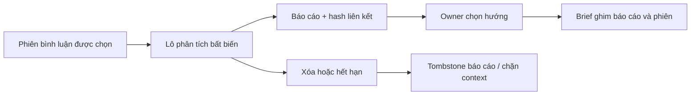

# Bình luận đã kiểm tra → báo cáo → hướng viết

Code kiểm thử/triển khai: `ba23d79ef4c6695985b5591e6a48247e133e4b0c`. Ghi nhận: 2026-10-01 19:40 Asia/Ho_Chi_Minh.
Nhánh `codex/page-workspaces-research`. Đây là nghiệm thu một phần của mục tiêu
Page workspace/Nghiên cứu; media và provider/Facebook live còn thiếu.

## Hành vi đã triển khai

Sau khi Owner yêu cầu phân tích các đoạn bình luận đã kiểm tra, worker lưu kết
quả rồi tạo một durable job báo cáo trong cùng transaction kết thúc. Dispatch
sau commit; Redis lỗi không làm mất job con. Báo cáo chỉ nhận phần tổng hợp đã
kiểm tra, hồ sơ Owner áp dụng và coverage, không nhận lại bình luận gốc, alias,
identity hay các đoạn ngoài lựa chọn. Mở/reload không tự gọi AI.

Mỗi báo cáo và mỗi hướng viết giữ batch/input/result hash thực sự đã dùng.
Chọn hướng chỉ tạo chiến dịch nháp; chưa sinh bài hoặc xuất bản. Sửa brief giữ
nguồn đã ghim; API từ chối thay/ngắt nguồn âm thầm. Content worker chỉ đọc đúng
phiên, không thay bằng latest. Đổi profile/context hoặc mất lease trong lúc gọi
provider không được ghi báo cáo. Ngân sách hai bước dùng ledger chung
2USD/workspace/ngày Việt Nam; deferred và outcome_unknown không tự gửi lại.

Suppression/expiry xóa kết quả liên quan, tombstone đúng báo cáo phụ thuộc và
khóa context chiến dịch đó; không xóa báo cáo không liên quan. Sửa brief không
gỡ tombstone. Báo cáo bình luận không được sao chép vào Redis response cache;
billing cache chỉ giữ con trỏ ID. Lịch sử nội dung doanh nghiệp đã tự soạn vẫn
được giữ; đây chưa phải nghiệm thu xóa dữ liệu xuyên backup/provider/media.

## Schema và contract

Migration bổ sung `0031_report_comment_analysis` sau0030, forward-only.
`market_report_comment_analyses` giữ company/group/report/source/batch ID,
input_hash, result_hash, created_at. Unique company/report/batch chống replay;
composite foreign keys khóa report/group, source/group và analysis/source trong
cùng tenant; index company/source/batch hỗ trợ erasure. Không sửa migration cũ,
không backfill báo cáo cũ bằng analysis mới.

History response thêm report_job_id/report_id (có thể NULL). OpenAPI/TypeScript
sinh bằng script repo. Không thêm enum trạng thái job chung hay collector mới.
UI báo cáo, chiến dịch và polling hiển thị nguồn và giới hạn của lô được chọn.

## Kiểm thử commit này

| Phạm vi | Kết quả | Bằng chứng / giới hạn |
| --- | --- | --- |
| Backend10 module | PASS |164 passed,18 skipped.17 là biến thể SQLite của các ca PG-only đã chạy ở biến thể PostgreSQL;1 là so sánh schema0030 lịch sử không cấu hình URL lần này. So sánh0031 thật đã chạy. |
| Fresh/upgrade PostgreSQL18.3 | PASS | PG15559: tạo mới head0031 và copy0030→0031; columns/types/defaults/unique/index/FK so khớp |
| Tenant và group | PASS | SQL không liên kết analysis của source thuộc nhóm khác vào report; API giữ quyền/tenant |
| Fencing/replay/recovery | PASS PG | Commit job trước dispatch false, một child/cycle/report, stale lease/context không ghi; duplicate task không gọi provider thêm |
| Context/budget/xóa | PASS PG | Thay hash không đọc latest; sửa brief giữ pins; suppression/expiry/brand change; deferred và timeout không resubmit |
| Frontend | PASS | Lint,66 unit tests/9files; typecheck trong production build; build mocks0/API8001 |
| Contract/static | PASS | OpenAPI --check, Ruff các file sửa, diff/staged whitespace và kiểm tra mẫu/giá trị secret |
| Browser→Redis/Celery→PG→reload | PASS adapters tổng hợp |1E2E14.7s (15.3s tổng) tại web13108/API18011; queue agent, inline0, nguồn/chiến dịch còn sau reload |
| Gemini native payload | PASS fixture | Native SDK + HTTPX MockTransport: mỗi flow1analysis +1report; report chỉ nhận summary. Tổng3 lượt thử6call tổng hợp,0live |
| Facebook/Gemini live | NOT_RUN lần này | Không coi Meta fixture là public Tier0; không thay smoke503 lịch sử thành PASS |
| Media và phạm vi toàn bộ plan | IN_PROGRESS | Download/privacy hold/media analysis/provider erasure và live coverage chưa nghiệm thu |

Lệnh backend: `python -m pytest -q -p no:cacheprovider tests/test_comment_report_workflow.py tests/test_screened_comment_analysis.py tests/test_owned_comment_api.py tests/test_comment_suppression.py tests/test_research_comment_quarantine.py tests/test_market_research_api.py tests/test_campaign_workflows.py tests/test_gemini_text_provider.py tests/test_ai_budget.py tests/test_agents.py`.
Đặt POSTGRES_OWNED_COMMENT_TEST_URL, POSTGRES_COMMENT_REPORT_FRESH_URL và
POSTGRES_COMMENT_REPORT_UPGRADE_URL vào DB test riêng. Không chạy test xóa
trên preview/người dùng. Frontend dùng các script lint/test/build trong manifest.
E2E opt-in `E2E_COMMENT_REPORT=1`, `E2E_REAL_EXTERNAL_SERVER=1`, API18011/web13108,
credential file test riêng và `screened-comment-analysis.real.spec.ts`.

## Bằng chứng PostgreSQL/browser (dữ liệu tổng hợp)

- Workspace `709b513b-579e-4125-9a73-a61502724c47`, source `54eee369-12fc-4ca5-8845-bcaff276cfa8`.
- Crawl job `a6e543db-1eb5-4430-a3e2-c8d10b695c65`; analysis job `3eaf0bc7-657d-4e22-beb1-fbf15ea7d0d7`.
- Batch `2ce89741-2f6b-43af-b85e-189d25a14ec9`; report job `78405119-30c9-4bad-ab3a-ddb9c212a39b`.
- Report `ef9ade9c-850e-491a-ac25-d4fa2690b824`; campaign `969cf947-02f4-404b-8c1f-ea33cb3f2ce2`.
- Ba job succeeded/1attempt;1selected excerpt,0unselected/identity fields sent;
  report link/brief/batch input-result hashes khớp;2ledger rows,106microUSD theo
  usage tổng hợp, không phải hóa đơn thật;0reservation còn giữ.
- Screenshot chiến dịch sau reload đã xem trực tiếp, hiển thị nguồn đã ghim.
  File test/credentials/logs nằm ngoài Git; không chép tài liệu người dùng.

## Rollout

PASS: schema0030→0031; backup DB/storage
`page-comment-report-maintenance-20261001T123619Z` có checksum;67bảng lịch sử
giữ counts, bảng link mới rỗng. Không tạo live assessment/job/report link.
API8001 ready; worker default/agent và ingestion đúng queue, có task registry
comment_report. Page active, owned schedule off và hash secrets giữ nguyên.
Frontend real release `codex-page-workspaces-research-ba23d79ef4c6-20261001T123638Z`
tại13104, mocks0/API8001. Release trước giữ lại để rollback.0provider calls
trong rollout. Health/browser/cleanup sau rollout ghi ở phần bổ sung bên dưới.

## Tier và giới hạn thu thập

Collector public vẫn Tier0/no login/cookies. Tier1 của upstream mở thêm timeline
sâu, group discussions/search, không bảo đảm tất cả bình luận/replies hay người
tương tác. Likes/reactions của từng bình luận là chỉ số của bình luận, không phải
lịch sử tương tác xuyên Page của một người. Nhận diện/redactor không chứng minh
đã vô danh hay đáp ứng mọi nghĩa vụ pháp lý. Không thay Tier trong lát cắt này.
Nguồn: [facebook-cli v0.3.0](https://github.com/tamnd/facebook-cli/tree/v0.3.0#eight-surfaces-two-tiers).

PASS sau rollout: browser context riêng trên13104 kiểm tra login/register200, font200, API8001ready,0script errors và không có fixture origin18011. Không chạm phiên người dùng. Fixture API/worker/web13108/18011 đã dừng theo PID/cwd/port; PostgreSQL15559 và Redis16481/16482 đã dừng sau kiểm tra không còn client. Credentials/env tổng hợp đã xóa; DB verification giữ offline. Preview13104 tiếp tục chạy.
