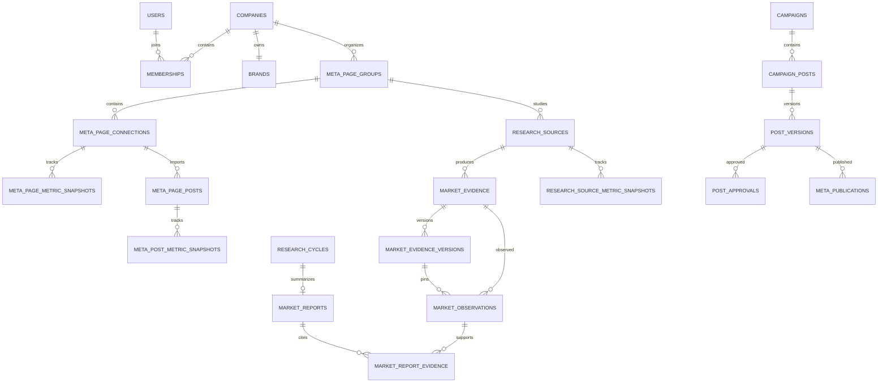

# Thiết kế dữ liệu PostgreSQL, Redis và object storage

Phạm vi: database/API slice của branch `codex/page-groups-market-research`, migration `0013_metric_history_and_tenant_integrity`. PostgreSQL là nguồn dữ liệu nghiệp vụ; Redis chỉ giữ hàng đợi, rate limits và cache ngắn hạn. File gốc nằm trong MinIO/S3; PostgreSQL lưu metadata, checksum và object key.

## Sơ đồ quan hệ



`companies` là workspace: hiện một workspace có một brand, nhiều membership, nhóm thị trường và Page. Membership quyết định Owner/Editor/Viewer. Mọi khóa quan hệ mới quan trọng đều ghép `company_id` với ID của cha để database tự ngăn liên kết chéo workspace, kể cả khi có bug ở API.

## Dữ liệu chính

| Khu vực | Bảng và quy tắc |
|---|---|
| Tài khoản và thương hiệu | `users`, `memberships`, `companies`, `refresh_sessions`, `invitations`, `password_reset_tokens`, `brands`, `brand_profile_revisions`. Token phiên và reset chỉ lưu dạng hash. |
| RAG | `documents`, `document_chunks`, `knowledge_chunks`. Giữ parser/chunker/model identity, dimension, nguồn và locator để truy vấn đúng phiên bản vector. |
| Page và thị trường | `meta_page_groups`, `meta_page_connections`, `research_sources`, `research_cycles`, `market_evidence`, `market_observations`, `market_reports`. Một group chứa nhiều Page và nguồn crawl. Page token mã hóa ở backend; khóa mã hóa cấu hình riêng. |
| Lịch sử nội dung và chỉ số | `market_evidence_versions`, `market_report_evidence`, `meta_post_metric_snapshots`, `meta_page_metric_snapshots`, `research_source_metric_snapshots`. Nội dung crawl bất biến tách khỏi observation; báo cáo tham chiếu đúng observation và phiên bản text; follower/member count được lưu riêng khỏi metric bài. |
| Chiến dịch và đăng bài | `campaigns`, `campaign_posts`, `post_versions`, `post_approvals`, `meta_publications`, `meta_page_posts`, `post_metric_snapshots`. Duyệt và đăng tham chiếu đúng phiên bản bài; phiên bản sửa sau duyệt phải duyệt lại. |
| Vận hành/AI | `jobs`, `job_steps`, `job_events`, `request_deduplications`, `audit_events`, `content_generation_runs`, `analytics_recommendations`. PostgreSQL giữ trạng thái lâu bền; Redis chỉ chuyển ID job. |

Model SQLAlchemy hiện định nghĩa 42 bảng. Migration thêm năm bảng snapshot/provenance, cột nullable `market_observations.evidence_version_id`, các candidate keys ghép tenant và foreign keys tương ứng. `market_reports.cycle_id` là liên kết chính; migration chuyển dữ liệu từ `research_cycles.report_id` cũ rồi bỏ pointer ngược.

## Lịch sử và tính đúng nguồn

- Mỗi lần nội dung crawl thay đổi sẽ có `market_evidence_versions` mới, phân biệt bằng hash nội dung và `parser_version`. Raw response có object key, SHA-256 và hạn xóa 30 ngày.
- Observation lưu số liệu và thời điểm UTC; report evidence giữ `report_id`, `observation_id` và `evidence_version_id`. Báo cáo cũ chỉ nhận provenance `verified` khi có liên kết xác minh được. Dữ liệu cũ thiếu text/version được trả `legacy_unverifiable`, không gán nội dung hiện tại cho quá khứ.
- Bài Meta lưu lịch sử count reactions/comments/shares/views trong `meta_post_metric_snapshots`; followers của Page ở `meta_page_metric_snapshots`; followers/members nguồn đối thủ ở `research_source_metric_snapshots`. Giá trị chưa có là `NULL` kèm `missing_metrics_json`, không phải 0. Chỉ số bài và audience không bị cộng lẫn.
- Snapshot mới là append-only theo service path. `snapshot_key` chống tạo trùng khi cùng job được giao lại. Đăng Facebook có trạng thái `outcome_unknown`; job đó phải đối soát, không gửi lại tự động.
- V1 giữ vector exact search có lọc company/brand/source/model/dimension; chưa thêm HNSW. Không phân vùng bảng trước khi có số liệu quy mô.

## PostgreSQL, Redis và object storage

| Dịch vụ | Vai trò | Chính sách hiện tại |
|---|---|---|
| PostgreSQL + pgvector | Nguồn dữ liệu nghiệp vụ, trạng thái job, vectors | UTC `timestamptz`; `scripts/backup_postgres.sh` tạo custom dump theo database và giữ 14 bản gần nhất. Scheduler gọi script mỗi ngày; restore diễn tập trên database mới. |
| Redis queue (`REDIS_URL`) | Celery `default`/`agent`, rate limits | Compose dùng instance riêng, AOF `everysec`, `noeviction`, maxmemory mặc định 256 MB. Celery result hết hạn sau 1 giờ. Job được commit vào PostgreSQL trước khi enqueue; scheduler tìm việc đến hạn trong DB. |
| Redis cache (`REDIS_CACHE_URL`) | Dashboard và report response cache | Instance ephemeral riêng, `allkeys-lru`, maxmemory mặc định 64 MB; TTL dashboard 60 giây, report 300 giây. Cache tắt/lỗi chỉ làm chậm request; key gồm workspace và signature dữ liệu/truy vấn. |
| MinIO/S3 | File upload, raw crawl, ảnh và export | DB chỉ chứa key/checksum/metadata; raw crawl hết hạn sau 30 ngày. |

Không tách `/0` và `/1` trên cùng một Redis để giả lập eviction policy khác nhau; Compose tạo hai service. Có thể override `REDIS_CACHE_URL`, `REDIS_CACHE_PORT` và `REDIS_CACHE_MAXMEMORY` trong `.env`.

## Migration và kiểm tra

Trên database đã được backup và sau khi xác nhận môi trường:

```bash
alembic upgrade head
alembic current
```

`0013_metric_history_and_tenant_integrity` kiểm tra liên kết chéo tenant và report trùng trước khi thêm khóa. Nếu phát hiện dữ liệu cũ sai, migration dừng với tên quan hệ cần xử lý; không tự sửa hay xóa dữ liệu. Downgrade trả lại `research_cycles.report_id` và xóa các bảng/cột mới; các tenant constraints được giữ để không làm yếu tính toàn vẹn. Migration từ schema 0012, downgrade/upgrade, và PostgreSQL custom dump/restore đã pass trên PostgreSQL 18.3 + pgvector trong database tạm; restore giữ Alembic revision, extension và workspace mẫu.

Kiểm thử hiện gồm Python suite, OpenAPI/type generation, SQLite migration round-trip, PostgreSQL 0012→0013 + downgrade/upgrade + dump/restore, và Redis queue/cache policies trên các instance tạm. Redis outage/recovery qua ứng dụng, Compose/MinIO và in-flight worker crash còn phải nghiệm thu trước production. Xem [runbook](runbook.md) và [test report](test-report.md).
