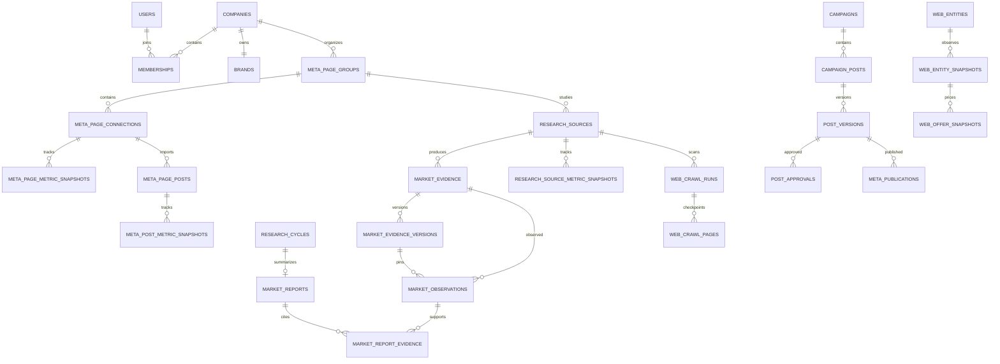

# Thiết kế dữ liệu PostgreSQL, Redis và object storage

Phạm vi: toàn bộ database/API slice trên branch `codex/project-database-hardening`, migration head `0017_web_entity_snapshot_immutability`. `companies` đại diện workspace, hiện một workspace có một thương hiệu, nhiều thành viên, nhóm và Fanpage. PostgreSQL là nguồn dữ liệu nghiệp vụ; Redis chỉ giữ hàng đợi, rate limits và cache ngắn hạn. File gốc nằm trong object storage; PostgreSQL lưu metadata, checksum và object key.

## Sơ đồ quan hệ


```mermaid
erDiagram
    USERS ||--o{ MEMBERSHIPS : joins
    COMPANIES ||--o{ MEMBERSHIPS : contains
    COMPANIES ||--|| BRANDS : owns
    COMPANIES ||--o{ META_PAGE_GROUPS : organizes
    META_PAGE_GROUPS ||--o{ META_PAGE_CONNECTIONS : contains
    META_PAGE_GROUPS ||--o{ RESEARCH_SOURCES : studies
    RESEARCH_SOURCES ||--o{ MARKET_EVIDENCE : produces
    MARKET_EVIDENCE ||--o{ MARKET_EVIDENCE_VERSIONS : versions
    MARKET_EVIDENCE ||--o{ MARKET_OBSERVATIONS : observed
    MARKET_EVIDENCE_VERSIONS ||--o{ MARKET_OBSERVATIONS : pins
    RESEARCH_CYCLES ||--o| MARKET_REPORTS : summarizes
    MARKET_REPORTS ||--o{ MARKET_REPORT_EVIDENCE : cites
    MARKET_OBSERVATIONS ||--o{ MARKET_REPORT_EVIDENCE : supports
    META_PAGE_CONNECTIONS ||--o{ META_PAGE_METRIC_SNAPSHOTS : tracks
    META_PAGE_CONNECTIONS ||--o{ META_PAGE_POSTS : imports
    META_PAGE_POSTS ||--o{ META_POST_METRIC_SNAPSHOTS : tracks
    RESEARCH_SOURCES ||--o{ RESEARCH_SOURCE_METRIC_SNAPSHOTS : tracks
    CAMPAIGNS ||--o{ CAMPAIGN_POSTS : contains
    CAMPAIGN_POSTS ||--o{ POST_VERSIONS : versions
    POST_VERSIONS ||--o{ POST_APPROVALS : approved
    POST_VERSIONS ||--o{ META_PUBLICATIONS : published
    RESEARCH_SOURCES ||--o{ WEB_CRAWL_RUNS : scans
    WEB_CRAWL_RUNS ||--o{ WEB_CRAWL_PAGES : checkpoints
    WEB_ENTITIES ||--o{ WEB_ENTITY_SNAPSHOTS : observes
    WEB_ENTITY_SNAPSHOTS ||--o{ WEB_OFFER_SNAPSHOTS : prices
```

`companies` là workspace: hiện một workspace có một brand, nhiều membership, nhóm thị trường và Page. Membership quyết định Owner/Editor/Viewer. Mọi khóa quan hệ mới quan trọng đều ghép `company_id` với ID của cha để database tự ngăn liên kết chéo workspace, kể cả khi có bug ở API.

## Dữ liệu chính

| Khu vực | Bảng và quy tắc |
|---|---|
| Tài khoản và thương hiệu | `users`, `memberships`, `companies`, `refresh_sessions`, `invitations`, `password_reset_tokens`, `brands`, `brand_profile_revisions`. Token phiên và reset chỉ lưu dạng hash. |
| RAG | `documents`, `document_chunks`, `knowledge_chunks`. Giữ parser/chunker/model identity, dimension, nguồn và locator để truy vấn đúng phiên bản vector. |
| Page và thị trường | `meta_page_groups`, `meta_page_connections`, `research_sources`, `research_cycles`, `market_evidence`, `market_observations`, `market_reports`. Một group chứa nhiều Page và nguồn crawl. Page token mã hóa ở backend; khóa mã hóa cấu hình riêng. |
| Lịch sử nội dung và chỉ số | `market_evidence_versions`, `market_report_evidence`, `meta_post_metric_snapshots`, `meta_page_metric_snapshots`, `research_source_metric_snapshots`. Nội dung crawl bất biến tách khỏi observation; báo cáo tham chiếu đúng observation và phiên bản text; follower/member count được lưu riêng khỏi metric bài. |
| Chiến dịch và đăng bài | `campaigns`, `campaign_posts`, `post_versions`, `post_approvals`, `meta_publications`, `meta_page_posts`, `post_metric_snapshots`. Duyệt và đăng tham chiếu đúng phiên bản bài; phiên bản sửa sau duyệt phải duyệt lại. |
| Catalog website | `web_crawl_runs`, `web_crawl_pages`, `web_entities`, `web_entity_snapshots`, `web_offer_snapshots`. Giá/offer dùng `Numeric`, giá trị thiếu giữ `NULL`, mỗi snapshot trỏ tới đúng evidence, observation và evidence version. |
| Vận hành/AI | `jobs`, `job_steps`, `job_events`, `request_deduplications`, `audit_events`, `content_generation_runs`, `analytics_recommendations`. PostgreSQL giữ trạng thái lâu bền; Redis chỉ chuyển ID job. |

Model SQLAlchemy định nghĩa 48 bảng; PostgreSQL có thêm `alembic_version`. Vector nằm trong pgvector và gắn model/version/dimension. Migration `0015` thêm claim token, bộ đếm dispatch và mã lỗi dispatch an toàn; ràng buộc crawl run → job cùng workspace; các liên kết crawl page → observation/version; và deferred constraint trigger để `latest_snapshot_id` luôn thuộc đúng entity/workspace. Migration `0016` sửa lệch lịch sử bằng cách thêm `market_report_evidence.created_at` nếu database cũ thiếu cột này, điền từ thời điểm tạo báo cáo liên kết hoặc thời điểm migration. Migration `0017` mở rộng guard để ngăn sửa hoặc xóa snapshot đang được entity dùng làm bản mới nhất. Bản ghi không hợp lệ làm migration dừng để xử lý rõ ràng.

## Lịch sử và tính đúng nguồn

- Mỗi lần nội dung crawl thay đổi sẽ có `market_evidence_versions` mới, phân biệt bằng hash nội dung và `parser_version`. Raw response có object key, SHA-256 và hạn xóa 30 ngày.
- Observation lưu số liệu và thời điểm UTC; report evidence giữ `report_id`, `observation_id` và `evidence_version_id`. Báo cáo cũ chỉ nhận provenance `verified` khi có liên kết xác minh được. Dữ liệu cũ thiếu text/version được trả `legacy_unverifiable`, không gán nội dung hiện tại cho quá khứ.
- Bài Meta lưu lịch sử count reactions/comments/shares/views trong `meta_post_metric_snapshots`; followers của Page ở `meta_page_metric_snapshots`; followers/members nguồn đối thủ ở `research_source_metric_snapshots`. Giá trị chưa có là `NULL` kèm `missing_metrics_json`, không phải 0. Chỉ số bài và audience không bị cộng lẫn.
- Snapshot mới là append-only theo service path. `snapshot_key` chống tạo trùng khi cùng job được giao lại. Đăng Facebook có trạng thái `outcome_unknown`; job đó phải đối soát, không gửi lại tự động.
- Mỗi lần worker claim job nhận một `claim_token`. Mọi lần commit qua `SessionLocal` đều khóa job và so token; lần commit thất bại sẽ rollback nếu token đã đổi hoặc job bị hủy/thất bại. Commit khi job vẫn đang chạy gia hạn lease. Token cũ không được ghi đè dữ liệu sau khi job được nhận lại.
- V1 giữ vector exact search có lọc company/brand/source/model/dimension; chưa thêm HNSW. Không phân vùng bảng trước khi có số liệu quy mô.

## PostgreSQL, Redis và object storage

| Dịch vụ | Vai trò | Chính sách hiện tại |
|---|---|---|
| PostgreSQL + pgvector | Nguồn dữ liệu nghiệp vụ, trạng thái job, vectors | UTC `timestamptz`; Alembic là nguồn schema. Backup gồm dump PostgreSQL cùng file storage; lịch local được cấu hình riêng, không phải Celery Beat. |
| Redis queue (`REDIS_URL`) | Celery `default`/`agent`, rate limits | Instance riêng, AOF `everysec`, `noeviction`, maxmemory 256 MB. Job commit ở PostgreSQL trước khi enqueue; lỗi gửi được lưu dưới mã ổn định, scheduler có thể thử gửi lại khi lease hết hạn. |
| Redis cache (`REDIS_CACHE_URL`) | Dashboard và report response cache | Instance ephemeral riêng, `allkeys-lru`, maxmemory mặc định 64 MB; TTL dashboard 60 giây, report 300 giây. Cache tắt/lỗi chỉ làm chậm request; key gồm workspace và signature dữ liệu/truy vấn. |
| MinIO/S3 | File upload, raw crawl, ảnh và export | DB chỉ chứa key/checksum/metadata; raw crawl hết hạn sau 30 ngày. |

Local nghiệm thu branch này dùng PostgreSQL 18.3 + pgvector, Redis queue `16379` và cache `16380`, chỉ bind loopback. Compose hiện tại dùng PostgreSQL 16 + pgvector và Redis 7.4; CI kiểm tra đúng các image đó. `agentic_app` là role runtime CRUD; `agentic_owner` chạy migration. Extension `vector` cần được cài bằng role database admin một lần trước migration.

Không tách `/0` và `/1` trên cùng một Redis để giả lập eviction policy khác nhau; Compose tạo hai service. Có thể override `REDIS_CACHE_URL`, `REDIS_CACHE_PORT` và `REDIS_CACHE_MAXMEMORY` trong `.env`.

## Migration và kiểm tra

Trên database đã được backup và sau khi xác nhận môi trường:

```bash
alembic upgrade head
alembic current
```

`0015_database_job_and_crawl_integrity` kiểm tra references cũ trước khi thêm constraint; lỗi hiển thị số bản ghi và quan hệ cần sửa. `0016_market_report_evidence_created_at` giữ dữ liệu lịch sử và chỉ bổ sung cột thiếu. `0017_web_entity_snapshot_immutability` tăng cường bảo vệ snapshot mới nhất mà không thay đổi cấu trúc ORM. Không chạy downgrade trên dữ liệu đang dùng để rollback migration; sửa tiến về trước hoặc restore bản backup vào database riêng. Migration chạy trên PostgreSQL 18.3 + pgvector từ schema mới và schema cũ; `alembic check` phải sạch.

Backup chạy bởi user LaunchAgent hằng ngày, giữ 14 bản nhóm PostgreSQL + storage; chạy restore riêng để xác minh manifest/hash và migration head. Khi restore, admin tạo database và cài extension `vector`; `agentic_owner` khôi phục object, sau đó quyền runtime và default privileges được cấp lại cho `agentic_app`. Không đặt lịch backup trong Celery vì hàng đợi phụ thuộc chính dịch vụ PostgreSQL/Redis đang được bảo vệ.

Xem [runbook database](database-runbook.md), [tiến trình](database-rollout-progress.md), và [báo cáo kiểm chứng](database-verification.md).
