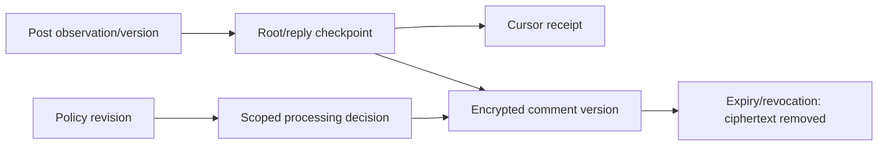

# Runbook Page workspace và Nghiên cứu

Cấu hình hiện hành: tất cả vai trò AI dùng Gemini `gemini-3.8-flash` theo lựa
chọn mới của người dùng. Các đoạn DeepSeek/Qwen bên dưới là ghi chép lịch sử,
không phải hướng dẫn bật provider/fallback cho preview hiện tại.

## Phân tích bình luận đã kiểm tra (schema0030)

Trong Nghiên cứu→Bài viết & bình luận, Owner mở các candidate còn hạn24h, chọn
**Rà soát để phân tích bằng Gemini**. Chọn/sửa đoạn để loại dữ liệu cá nhân còn
sót; ghi tham chiếu hồ sơ đánh giá xử lý/gửi provider phù hợp; bấm phân tích.
Không coi một ô tham chiếu là sự đồng ý của người bình luận hay chứng nhận pháp lý.
Giới hạn50đoạn,1500ký tự/đoạn,12000ký tự tổng. Bản kiểm tra/kết quả tối đa90ngày;
nguồn raw vẫn24h. Chỉ Owner xem citations đã kiểm tra; không có identity trường
tác giả trong provider input. Mở/reload không tự gọi AI.

Worker agent nhận `research_comment_analysis`; API/worker đọc Gemini key từ
runtime secret store hiện có, model cố định `gemini-3.8-flash`. Ngân sách2USD/ngày
dùng ledger tự động chung. `deferred_budget` chờ ngày Việt Nam kế tiếp, không mất
lựa chọn; `provider_outcome_unknown` cần đối soát trước retry, không gửi lại vô hạn.
Thiếu model/key/pricing trả lỗi riêng; không thay provider.

Xóa bình luận vô hiệu các lô đã dùng phiên đó, không xóa lô không liên quan. Beat
purge lô quá90ngày. Xóa nguồn xóa lô và đoạn kiểm tra. Từ schema0031, báo cáo/hướng
viết ghim đúng input/result hash của lô; xóa vô hiệu đúng báo cáo/chiến dịch phụ thuộc.
Migration0030/0031 forward-only; rollback
bằng tắt đường phân tích/frontend, giữ worker đọc suppression/retention/schema.
Không downgrade hoặc quay về code bỏ qua deletion ledger. Không bật live analysis
chỉ từ việc có API key; operator vẫn phải xác định điều kiện xử lý và gửi dữ liệu.
Xem [bằng chứng và giới hạn](screened-comment-analysis-verification.md).


Bổ sung xóa bình luận: [comment-deletion-runbook.md](comment-deletion-runbook.md). Schema0031 đã rollout; bảng trạng thái trong verification là nguồn mới nhất. Không restore/revert worker bỏ qua suppression ledger.


## Báo cáo và chọn hướng viết (schema0031)

Sau khi Owner bấm phân tích lô đã kiểm tra, một job `research_comment_report`
trên queue agent tiếp tục tạo báo cáo, dùng summary có coverage và hồ sơ thủ
công. Hai bước AI dùng chung hạn mức2USD/ngày. Không gửi lại raw comments/author
cho bước report. Không có topic thì không tạo report thành công từ dữ liệu rỗng.

Trong kết quả có trạng thái job report và **Xem báo cáo và chọn hướng viết**.
Owner/Editor theo quyền hiện có chọn **Tạo chiến dịch nháp**, rồi xem/sửa brief.
Thao tác này chưa tạo bài/duyệt/đăng. Chiến dịch hiển thị nguồn đã ghim; sửa brief
giữ pins. Muốn dùng nguồn/hướng mới phải chọn lại từ report, không sửa IDs JSON.

Nếu nguồn hết hạn/xóa, UI báo cần chọn hướng mới; sửa brief không gỡ marker.
`deferred_budget` chờ ngày Việt Nam kế tiếp; `provider_outcome_unknown` cần đối
soát, không bấm gửi liên tục. Job queued sau lỗi broker được scheduler phục hồi.
API/worker/Beat phải cùng schema0031 trước khi bật luồng mới. Không downgrade
bảng provenance hoặc rollback về worker bỏ qua suppression/Page gate.

Backup DB/storage dưới runtime backups; frontend release trước được giữ. Start/
stop vẫn chỉ các label auth-preview đã xác minh trong phần vận hành hiện có.
Không reset database, purge Redis dùng chung hay sao chép key vào worktree.
Xem [kiểm thử, IDs và giới hạn](comment-report-workflow-verification.md).

## Bình luận Page công ty qua giao diện

Vào Nghiên cứu → Thu thập → nguồn Fanpage công ty → **Bài viết & bình luận**.
Crawl bài viết trước để có frontier. Owner lưu mục đích/căn cứ trong Chính sách dữ liệu
và ghi nhận đánh giá phạm vi local hiện hành; đây không phải sự đồng ý của người bình luận.
Cấu hình không được tự bật khi deploy và không hỏi lại mỗi lượt.

**Thu thập bình luận và replies** tạo job qua queue agent. Đang chạy thì dùng job hiện có;
reload đọc lại job từ API. Chưa có frontier/đã đổi decision thì xử lý lỗi tương ứng, không bấm
lặp để tạo thêm job. Meta đọc hết cursor/replies có thể truy cập; bình luận ẩn/xóa vẫn có thể thiếu.
Public Page tiếp tục lấy bình luận trong Crawl ngay Tier0, không dùng nút phân trang Meta này.

Owner mở **Xem bình luận và tương tác** để xem candidate còn thời hạn24h và replies.
Like là like_count từng bình luận, không phải tổng reactions hay lịch sử tương tác của một người.
Không rõ tác giả phải giữ unknown, không suy hai comment cùng người. Tổng comment/replies
không so trực tiếp với root-edge count. Loại dữ liệu theo runbook suppression hiện có.
Thiếu/reconnect Page không cho đọc/thu thập candidate mới; xóa dữ liệu vẫn dùng được.

Chi tiết kiểm thử: [owned-page-comments-verification.md](owned-page-comments-verification.md).
Chưa gửi candidates này sang Gemini và chưa phân tích ảnh/video.

## Cấu hình hiện hành — Gemini cho mọi tác vụ AI

Quyết định Owner ngày 2026-09-30 thay toàn bộ tác vụ LLM sang Gemini `gemini-3.8-flash`.
DeepSeek/Qwen trong các phần lịch sử dưới đây không còn là routing đang chọn.
Docling, collector và retrieval local không đổi. Hồ sơ vẫn do Owner viết.

File `/Users/lethanh/.local/share/agentic-marketing/secrets/research-ai.env` phải có quyền `0600`:

```dotenv
LLM_PROVIDER=gemini
LLM_DEFAULT_MODEL=gemini-3.8-flash
GEMINI_MODEL=gemini-3.8-flash
GEMINI_API_KEY=<secret-entered-locally>
GEMINI_MAX_OUTPUT_TOKENS=8192
```

Launcher đọc file mỗi lần API/worker khởi động, trước khi import settings. Không đặt key
trong plist, frontend, Git hoặc shell history. Không sửa `deepseek-docling.env`; key cũ
vẫn được giữ nhưng không truyền tới process khi Gemini được chọn. Qwen không được nạp.
Worker ingestion/Beat không nhận key AI. API/worker dùng chung model, database, storage và queue.

Chạy bằng virtualenv preview từ checkout đã triển khai:

```bash
python scripts/local_preview_runtime.py status
python scripts/local_preview_runtime.py probe-model
```

`status` chỉ hiện có/thiếu key và model. `probe-model` chỉ GET metadata model, không tạo nội dung.
Key đã được Owner nạp và model đã trả khả dụng. Hai smoke tổng hợp qua Redis/Celery/PostgreSQL
test chưa tạo được phân tích: lần thứ hai nhận HTTP 503. Không gọi lặp hoặc tự đổi model;
reservation chưa rõ kết quả giữ để đối soát. Bản mới trả mã `provider_http_503` đã làm sạch khi phù hợp;
hai job smoke cũ được tạo trước thay đổi này nên không được mô tả như đã lưu trường mã lỗi mới.

Text adapter reserve tạm theo toàn bộ trần đầu vào 1.048.576 token và output đã cấu hình,
không ước lượng token từ ký tự. Settlement dùng usage thật, gồm thinking tokens, rồi nhả phần
chưa dùng. Cách này an toàn nhưng có thể hoãn sớm các tác vụ chạy đồng thời; chưa tích hợp countTokens.
Comment adapter đã chuyển sang Gemini và kiểm tra privacy/citation bằng fixture. Worker
comment/replies đã có cho local quarantine có decision phù hợp; chưa nối review/approved
batch sang Gemini hoặc media worker, nên chưa phải phân tích Facebook đầy đủ.

Page encryption key nằm trong `secrets/page-connection.env`, quyền `0600`, tách khỏi AI key.
Key được tạo một lần sau khi xác minh preview chưa có token mã hóa; giữ bền vững qua restart.
Không tạo lại key khi có token đã lưu. Backup key riêng với database; không ghi giá trị trong docs.

## Preview đang chạy và khởi động lại

Checkout: `/Users/lethanh/.codex/worktrees/page-workspaces-research/agent`.
Frontend real: `http://127.0.0.1:13104`; API/readiness: `http://127.0.0.1:8001/readyz`.
Schema preview đã nâng lên `0031_report_comment_analysis`. PostgreSQL15432, queue16379/4,
cache16380/4 và storage bền vững của preview giữ nguyên.

Launcher API/worker trong LaunchAgent dùng Python tại
`/Users/lethanh/.local/share/agentic-marketing/auth-preview/venvs/api-py311/bin/python`;
ingestion dùng venv `docling-py314`, không nhận API key AI. Không chạy installer toàn bộ để đổi key.

```bash
/Users/lethanh/.local/share/agentic-marketing/auth-preview/venvs/api-py311/bin/python scripts/local_preview_runtime.py status
python3 apps/web/scripts/creative-studio-preview.py status
```

Trước khi thay backend/worker, kiểm tra job queued/running và để lượt đang xử lý kết thúc.
Các label thuộc preview này:
`com.agentic-marketing.auth-preview-api`, `-worker`, `-ingestion`, `-beat`, `-web`.
Mỗi lệnh chỉ nhắm label đã xác minh; không dừng PostgreSQL/Redis dịch vụ khác.

```bash
# Restart chỉ API để nạp lại cấu hình/code đã kiểm tra.
launchctl kickstart -k "gui/$(id -u)/com.agentic-marketing.auth-preview-api"
# Dừng một worker sau khi drain, giữ database/queue/storage.
launchctl bootout "gui/$(id -u)/com.agentic-marketing.auth-preview-worker"
# Khởi động lại worker đã dừng; dùng đúng plist hiện có.
launchctl bootstrap "gui/$(id -u)" "$HOME/Library/LaunchAgents/com.agentic-marketing.auth-preview-worker.plist"
```

Launchd có thể từ chối bootstrap ngay khi tiến trình cũ vừa bootout; đợi unload
hoàn tất rồi thử lại bootstrap đúng label/plist, không chạy lại installer toàn bộ
hoặc purge queue. Kiểm tra readiness và registry sau restart, không xem bootstrap
thành công là API đã ready. Launcher dùng `auth-preview-agent@%h` (default,agent)
và `auth-preview-ingestion@%h` (ingestion), tránh trộn phản hồi control inspect.

Maintenance backup database/storage gần nhất trước migration0028:
`/Users/lethanh/.local/share/agentic-marketing/backups/page-comment-quarantine-maintenance-20260930T184019Z`.
Restore riêng đã kiểm tra checksum, counts61 bảng lịch sử và hash3 storage files sau upgrade0028.
Bundle này đã có dữ liệu Page Owner vừa kết nối; khóa mã hóa vẫn cần backup riêng.
Chưa chạy browser/login ứng dụng restored. Không restore đè preview.

Maintenance backup trước migration0021–0026, giữ để đối chiếu lịch sử:
`/Users/lethanh/.local/share/agentic-marketing/backups/page-workspace-maintenance-20260930T154320Z`.
Bundle chứa dump, storage archive, checksum manifest và plist trước rollout; không chứa bản sao AI key.
Giữ khóa mã hóa token riêng. Bản preflight online trước đó nằm ở bundle có chữ `preflight`,
không được mô tả là backup nhất quán khi dịch vụ đang ghi.

Final maintenance bundle đã restore vào database/storage test riêng, checksum, counts55 bảng lịch sử
và hash3 file storage khớp, schema0026. Chưa thử browser/login ứng dụng restored. Bundle được tạo
trước khi Owner kết nối Page thật; cần backup mới theo lịch vận hành để bảo vệ thay đổi sau đó.

Frontend được đóng gói thành release bất biến; release cũ/plist giữ riêng để rollback:

```bash
python3 apps/web/scripts/creative-studio-preview.py activate
python3 apps/web/scripts/creative-studio-preview.py rollback
```

Chỉ activate build real mới đã đạt checks. Frontend rollback không đổi backend hoặc schema.
Sau schema0028 không restore backend cũ thiếu Page gate hoặc thiếu tương thích frontier/quarantine; nếu lỗi, dùng bản mới giữ gate hoặc
tắt phần collector/AI trong khi sửa. Không downgrade migration hoặc restore đè database người dùng.

## Onboarding doanh nghiệp

1. Đăng ký/đăng nhập bằng tài khoản Agentic Marketing. Đăng ký tạo tài khoản và phiên, chưa tạo doanh nghiệp.
2. Ở màn hình chọn doanh nghiệp, Owner nhập Page ID và Page Access Token thuộc đúng Page.
3. Backend đọc Page identity và thử đọc một trang bài công khai; không đăng bài thử. Khi thành công, workspace lấy tên Page, lưu avatar an toàn nếu URL ảnh phù hợp, mã hóa token và tạo Owner/Brand trống.
4. Brand Profile vẫn do Owner tự viết. Page name/avatar chỉ là nhận diện workspace.
5. Thành viên khác tham gia bằng lời mời. Có token không tự cấp quyền thành viên.

Màn hình chọn doanh nghiệp luôn giữ nút Đăng xuất và không tự mở workspace duy nhất.
Logout lỗi giữ phiên/cache để người dùng thử lại; backend xác nhận thành công mới xóa cache.

### Chẩn đoán kết nối Page

Onboarding/reconnect đọc `/me` để kiểm tra token có cùng Page ID và có Page-only category, rồi đọc
`/{page_id}/posts?fields=id&limit=1`. Không yêu cầu các trường media/metrics ở bước kích hoạt;
Page chưa có bài vẫn có thể qua kiểm tra quyền đọc. Metadata không chứng minh quyền publish.

- `meta_page_identity_mismatch`: token đại diện một danh tính khác; lấy Page Access Token cho đúng Page.
- `meta_page_type_unverified`: identity khớp nhưng thiếu category của Page; không dùng token profile cá nhân để kích hoạt doanh nghiệp. Kiểm tra lại Page token, không bỏ guard.
- `meta_token_invalid`: Meta báo token hết hạn/thu hồi/không hợp lệ.
- `meta_page_identity_rejected`: Meta từ chối bước identity; chưa thể kết luận quyền đọc bài.
- `meta_page_permission_missing`: identity khớp, Meta từ chối posts edge tối thiểu; kiểm tra quyền ứng dụng/Page, đặc biệt `pages_read_engagement`, trước khi tạo lại Page token.
- `meta_rate_limited`: HTTP429; chờ rồi thử lại, không tạo token mới chỉ vì rate limit.
- `meta_verification_failed`: lỗi mạng/upstream/response; giữ dữ liệu và kết nối cũ, có thể thử lại.

Error `details` và log chỉ chứa `verification_step`, HTTP status khi có phản hồi Meta, Graph code/subcode và request ID.
Lỗi validation cục bộ không tạo HTTP status upstream giả.
Không log provider message, payload, token, tên người hoặc nội dung Page. Gửi mã yêu cầu để tra cứu,
không gửi token vào chat. Token/ID phải lấy cùng Page từ [collection chính thức của Meta](https://www.postman.com/meta/facebook/request/bqfxwbp/get-access-tokens-of-pages-you-manage).

API dùng trong vận hành:

- `POST /api/v1/auth/register` — tài khoản/session, không tạo workspace.
- `POST /api/v1/workspaces/from-page` — xác minh Page và tạo workspace.
- `PATCH /api/v1/workspaces/{workspace_id}/page-connection` — Owner thay token cho cùng Page ID; đổi Page cần workspace khác.
- `GET /api/v1/workspaces` — danh sách workspace đã được cấp membership.

Không đưa token vào tài liệu, ticket, browser storage, query string hoặc log. Chỉ nhập trên giao diện kết nối hoặc gửi request qua kênh bảo mật.

## Secrets

- Không dán API key, Page Access Token hoặc cookie vào chat, frontend bundle, Git hay log.
- Gemini đang được nạp từ backend secret store/runtime environment. DeepSeek/Qwen không là provider hoạt động.
- Page Access Token phải được mã hóa server-side bằng `META_TOKEN_ENCRYPTION_KEY`.
- Mẫu biến cấu hình sẽ dùng placeholder; file này không chứa giá trị bí mật.

`META_TOKEN_ENCRYPTION_KEY` phải được cấu hình ở backend trước khi Owner kết nối Page. Thiếu khóa trả `token_encryption_unavailable`; không tắt mã hóa để vượt lỗi.

## Kết nối lại Page

- Khi token hết hạn/thu hồi, workspace chuyển `needs_reconnect`; dữ liệu lịch sử vẫn đọc được, tác vụ mới bị chặn. Thời điểm chạy bị xóa nhưng `schedule_enabled` giữ nguyên ý định của Owner.
- Owner mở Cài đặt doanh nghiệp, nhập token mới và giữ nguyên Page ID. Backend xác minh lại trước khi thay token mã hóa.
- Nếu một nguồn đang chạy khi mất kết nối, kết quả dở dang không được coi là hoàn thành. Sau khi Owner xác minh lại đúng Page, lịch nguồn đang bật được đặt đến hạn để scheduler phục hồi; idempotency ngăn chạy trùng. Lịch đã tắt không tự bật.
- Lịch đăng đã quá hạn tuân thủ trạng thái missed hiện có; không gửi bù hàng loạt.
- Publication ở `outcome_unknown` cần Page hoạt động để đối soát; trong lúc token mất hiệu lực, chỉ xem trạng thái hoặc hủy lịch chưa bắt đầu, không xác nhận thủ công khi chưa thể kiểm tra Facebook.
- Khi Page cần kết nối lại, Owner vẫn có thể hủy lịch chưa bắt đầu. Lệnh hủy chỉ yêu cầu membership Owner và CSRF; tạo lịch/đăng mới tiếp tục bị chặn cho tới khi Page active.
- Lịch đồng bộ metrics Meta cũng có thể được Owner tắt khi Page cần kết nối lại. API cho phép đọc trạng thái lịch trong thời gian này; chỉ bật lại sau khi xác minh đúng Page và token.
- Xác minh Page bằng metadata và đọc bài chỉ xác nhận danh tính/quyền đọc bài. API trả `publish_capability=not_tested` cho tới khi có lần xuất bản thành công gắn với token hiện tại; chưa thử đăng không đồng nghĩa chắc chắn Meta sẽ từ chối. Giao diện vẫn cần Owner xác nhận bài đã duyệt, còn Meta quyết định tại lần gửi.
- `can_sync_metrics` trong API cho biết ứng dụng có thể gửi yêu cầu đồng bộ; đây không phải cam kết mọi permission/metric đều có sẵn. UI gọi đây là khả năng “yêu cầu đồng bộ”; trạng thái dữ liệu và metric thiếu vẫn lấy từ kết quả sync thực tế.

## Nghiên cứu

- Mở mục **Nghiên cứu**. Các nhóm database cũ vẫn được giữ; UI/API facade tự đặt nguồn mới vào nhóm nội bộ của workspace.
- Page doanh nghiệp được thêm tự động khi workspace kích hoạt. Các nguồn khác: website công khai, Page Facebook công khai và Group Facebook công khai.
- Bấm Crawl ngay cho nguồn hoặc nhóm nội bộ. Lịch nguồn có thể bật/tắt riêng; mở trang không tự chạy crawl.
- Public Page chạy collector `facebook-cli` Tier 0 hiện có; không đăng nhập. Public Group chỉ có thể trả thông tin nhóm, không có thảo luận Tier 1. Không báo hoàn thành toàn bộ lịch sử.
- Với Group mới, nhập URL trang chủ `https://www.facebook.com/groups/{id-or-slug}`. Bật/tắt lịch trên thẻ nguồn; Crawl ngay chạy dù lịch tắt. Runner chỉ đọc shell metadata công khai qua Tier 0, không gọi feed; run được lưu `partial`, `history_complete=false`, không sinh report từ metadata đơn lẻ. Nếu privacy không xác nhận public, trạng thái là `group_not_public` và lịch không tiếp tục tự thử. Nguồn public Group cần binary tại `FACEBOOK_CLI_RUNNER_PATH` đã build từ bản upstream ghim.
- Bình luận hiện ở trạng thái `privacy_hold`: mặc định không tải text và không gửi agent. Worker mới chỉ có thể đọc vào vùng quarantine mã hóa sau decision local được ghi nhận phù hợp; preview chưa có decision active. Endpoint nhập thủ công vẫn bỏ comment text. Văn bản bài Facebook và manual import chạy qua `facebook-contact-patterns-v1`; bộ lọc không phát hiện tên hoặc mọi kiểu PII và không phải ẩn danh. Media chưa có pipeline tải/phân tích.
- Vì vậy, evidence Facebook chưa được gửi dạng tiêu đề/nội dung vào provider đang chọn (Gemini). Report chỉ có Facebook trả `deferred_privacy_review` và không gọi model; report lẫn website chỉ gửi metrics/IDs và nhãn giữ nội dung từ Facebook. Kết quả cache chỉ được phát lại khi fingerprint evidence/version/trạng thái Facebook khớp với lượt hiện tại. Chưa có đường chuyển trạng thái sang `approved_for_provider`.
- Owner có thể xem/ghi nhận cấu hình theo nguồn tại `GET/PUT /api/v1/workspaces/{workspace_id}/market-research/sources/{source_id}/privacy-policy`: mục đích, tham chiếu hồ sơ căn cứ, phiên bản chính sách và thời hạn lưu dự kiến (1–365 ngày, mặc định UI 90). Thao tác yêu cầu Owner + CSRF; các revision giữ lịch sử, gửi lại đúng cùng nội dung idempotent.
- Nguồn Facebook mới ở `needs_privacy_policy`; worker và manual import kiểm tra lại mục đích/tham chiếu trước khi xử lý. Khi đủ trường cấu hình, nguồn được mở lại cho collector theo lịch đã chọn. `collection_ready` chỉ có nghĩa là đủ trường; `legal_basis_verified` luôn `false`. Đây không xác minh quyền xử lý, sự đồng ý hay tuân thủ. Nếu tổ chức chưa xác định được căn cứ áp dụng, giữ nguồn tạm dừng thay vì nhập dữ liệu giả để vượt gate.
- Trạng thái response luôn `retention_enforcement_status=not_enforced` và `comments_content_status=privacy_hold`. Riêng raw payload quarantine có lịch xóa kỹ thuật 24 giờ; thời hạn do Owner ghi trong form chưa được áp dụng lên nội dung chuẩn hóa. Nhập mục đích/căn cứ không chứng minh quyền xử lý hoặc đồng ý của chủ thể và không mở comment/media sang provider. Audit log không chứa văn bản mục đích/căn cứ.
- Nguồn pháp luật chính thức được kiểm tra ngày 2026-09-30: [Luật 91/2025/QH15](https://vanban.chinhphu.vn/?classid=1&docid=214590&pageid=27160&typegroupid=3) và [Nghị định 356/2025/NĐ-CP](https://vanban.chinhphu.vn/?classid=1&docid=216387&orggroupid=2&pageid=27160). Cổng Chính phủ ghi cả hai có hiệu lực từ 01-01-2026. Lượt kiểm tra này chỉ xác nhận thông tin văn bản/ngày hiệu lực, không phải rà soát điều khoản, ý kiến pháp lý hoặc kết luận rằng sản phẩm/tổ chức tuân thủ.
- Khi mở một lượt public Facebook mới, worker chụp ID/no/version và thời hạn yêu cầu của policy revision mới nhất vào `WebCrawlRun.config_json`. Đây là provenance bất biến theo lượt; chỉnh policy về sau không sửa lịch sử lượt cũ. Nếu lượt không có policy, API trả trường revision rỗng. Cả hai trường hợp vẫn giữ `privacy_hold`/`not_enforced`.
- Campaign tạo từ hướng viết của báo cáo giữ `report_id`, evidence version, observation, content hash và metrics cụ thể. Worker dùng pin đó; nếu report không có pin hoặc source đã tắt/xóa thì dừng để người dùng chọn lại. Comment text không được đưa vào Content Agent.
- Báo cáo AI mới dùng hồ sơ `manual_text_v1` của Owner chỉ khi đó là revision hiện hành đã áp dụng; report JSON và coverage giữ `brand_id`, `revision_id` và số revision. Campaign draft lưu provenance này để giữ đúng ngữ cảnh lịch sử. Hồ sơ legacy/AI cũ không được gửi làm hướng dẫn thương hiệu. Nếu chưa có hồ sơ Owner, báo cáo vẫn có thể phân tích nguồn nhưng phải ghi rõ chưa cá nhân hóa.
- Các giá trị nội bộ `Chưa xác định`, `unknown`, `not specified` và `n/a` không được biến thành audience hay market scope. Nếu chưa khai báo ngành/vùng rõ ràng, brief tạo từ report để audience rỗng thay vì bịa chân dung khách hàng.
- Snapshot website được chọn cũng phải thuộc cùng report/tenant và source còn active; worker chuyển phần dữ liệu đã allowlist (không kèm URL ảnh ký tạm) vào Content Agent, rồi xác minh lại các pin trước khi lưu draft.
- Lỗi nguồn mới không được xóa kết quả nguồn thành công trước đó.
- Raw research payload nếu cần quarantine được gắn hạn xóa tối đa 24 giờ; scheduler thử xóa object đến hạn và chỉ gỡ DB pointer sau khi storage xác nhận xóa. Nếu storage lỗi, pointer giữ lại để lần scheduler sau thử lại. Nội dung nghiên cứu chuẩn hóa 90 ngày, media 30 ngày và propagation khi có yêu cầu xóa vẫn chưa được triển khai đầy đủ; không coi raw TTL hoặc trường thời hạn trong policy form là cơ chế xóa dữ liệu cá nhân hoàn chỉnh.

### Bình luận/replies — executor local quarantine, chưa có review/provider UI

`research_comment_checkpoints` giữ frontier theo observation và version của bài Page sở hữu.
Root được tạo cùng transaction lưu observation, status `privacy_hold`; không chứa message, author,
profile link/avatar hoặc raw response. ID bài/cursor/parent là dữ liệu hạn chế nội bộ, chưa trả qua API list.
Rerun cùng observation giữ checkpoint đầu; lượt mới tạo root riêng, không sửa provenance lịch sử.

`MetaGraphClient.list_comments_page` hỗ trợ root và reply edge bằng cursor, limit1..100.
Transport đọc stream tối đa2 MiB cả wire và sau giải nén gzip/deflate có bound;
encoding khác bị từ chối. Deadline toàn request30 giây, read timeout15 giây,
không redirect hoặc proxy môi trường. Publish response lỗi/quá lớn vẫn unknown
để đối soát trước khi gửi lại; không tự coi timeout là chưa đăng thành công.
Không follow URL next, không yêu cầu author/media/comment attachment. Private/hidden record bị loại.
Text trả cho caller tối đa20.000 ký tự kèm truncated flag; đây là dữ liệu chưa screening,
không được serialize/persist/gửi AI trực tiếp. `pagination_exhausted` chỉ là edge đã hết cursor,
không chứng minh đã có bình luận ẩn/xóa hoặc toàn bộ replies.

Migration0028 bổ sung:

| Bảng | Phạm vi |
|---|---|
| research_comment_processing_decisions | Assessment reference, actor Owner, policy revision, expiry và scope local_comment_quarantine_v1; mặc định pending. Không phải sự đồng ý của người bình luận hoặc chứng nhận pháp lý. |
| research_comment_versions | Candidate ciphertext, hash, metadata redaction, likes/reply_count, captured/expiry và observation/version nguồn chính xác; không plaintext/author/profile. |
| research_comment_page_receipts | Cursor fingerprint, received/withheld counts và timestamp; receipt và progress ghi cùng transaction. |



Worker `services.worker.research_comments.research_comments_task` vào queue agent; job kind research_comments.
Batch tối đa500 bản ghi,20 requests,5 phút,100 bản ghi/request. Còn frontier thì job queued sau commit,
Beat dispatch trong tick kế tiếp; không chờ12 giờ giữa batch. Retry/backoff và successful batches tách riêng.
Reply ID phải xuất phát từ cùng observation/post; cursor cycle, đổi source/token/policy/decision và mất lease bị chặn.
Nội dung sửa tạo fingerprint/version mới, overlapping IDs không tăng count; report cũ không đọc candidate latest.

Cipher dùng HKDF miền riêng từ META_TOKEN_ENCRYPTION_KEY, hỗ trợ key previous hiện có.
Giữ key cũ đủ thời gian giải mã dữ liệu còn hạn; không tái sinh key khi đã có token/quarantine.
Ciphertext ràng buộc tenant/source/observation/comment. TTL SQL PostgreSQL tối đa24 giờ; Beat chỉ xóa
ciphertext đến hạn/thu hồi và audit số lượng, không dựng lại plaintext. Purge nguồn xóa thêm các record mới.
Backup có ciphertext cũ vẫn cần deletion/expiry ledger khi phục hồi trước khi phục vụ; phần này chưa triển khai đầy đủ.

`comment-contact-mentions-v1` che liên hệ, @handle và tên có nhãn; tên không nhãn/PII khác chưa bao phủ.
Mọi candidate vẫn privacy_hold, không anonymous, không có route approved_for_provider hoặc text response công khai.
Assessment mới pending/revoked không fallback về decision cũ. Policy notes không tạo decision và migration không bật quyền.
Chưa có API/UI nhập assessment/review; không bật bằng SQL/cờ giả hoặc lấy assessment fixture làm quyền xử lý live.
Legacy observation chưa pin version không được gán version hồi tố chỉ để tạo root mới.
Tiếp theo: workflow assessment/review, normalized screened comments, erasure/retention toàn luồng và Gemini budgeted analysis.

Kiểm thử pipeline phải dùng hạ tầng test riêng đã được tạo, không URL preview:

```bash
export DATABASE_URL=postgresql+asyncpg://postgres@127.0.0.1:15559/page_budget_test
export POSTGRES_TEST_URL="$DATABASE_URL"
export POSTGRES_FRESH_TEST_URL=postgresql+asyncpg://postgres@127.0.0.1:15559/page_comment_quarantine_fresh_20261001
export REDIS_URL=redis://127.0.0.1:16481/7
export REDIS_QUEUE_TEST_URL="$REDIS_URL"
export REDIS_CACHE_URL=redis://127.0.0.1:16482/7
export REDIS_CACHE_TEST_URL="$REDIS_CACHE_URL"
export AUTO_CREATE_SCHEMA=0 INLINE_JOBS=0
python -m pytest -p no:cacheprovider tests/test_postgres_application_modules.py tests/test_postgres_database_integration.py tests/test_postgres_comment_checkpoints.py tests/test_postgres_comment_quarantine.py -q --tb=short
```

DB fresh phải được tạo mới và chạy migrations độc lập; không dùng DB upgrade làm cả hai vế.
Assessment trong tests được gắn nhãn synthetic-only, không copy row/decision sang preview.
Các process test đã dừng sau nghiệm thu; lệnh start/stop ở phần hạ tầng disposable dưới đây chỉ dùng đúng datadir/ports đó.

## Adapter Qwen — lịch sử, không được chọn

Adapter text yêu cầu `QWEN_API_KEY`, `QWEN_MODEL` và `QWEN_BASE_URL` do quản trị viên cung cấp từ secret store/runtime. `QWEN_BASE_URL` phải là HTTPS endpoint Model Studio đúng region/workspace; không dùng endpoint giả định. Có thể cấu hình `QWEN_MAX_TOKENS`, còn giới hạn input dùng `LLM_MAX_INPUT_CHARS`. Qwen chỉ có method `summarize_screened_comments(PrivacyApprovedCommentBatch)`; đường `generate` tổng quát bị khóa. Batch cần policy decision/version và run-scoped evidence refs, không có trường author/profile; decision ID/version chỉ dùng nội bộ, không gửi model. Adapter kiểm tra mọi citation trả về có trong batch và tắt repair/retry để tránh lời gọi chưa reserve chi phí. Hiện chưa có route gọi adapter từ pipeline bình luận, chưa có Qwen pricing entry trong ledger và chưa có key/region đã nghiệm thu. Không bật bằng cách chỉ đặt ba biến; trước hết cần privacy-approved comment batch và mức giá phù hợp model/region. Xem [endpoint OpenAI-compatible chính thức](https://www.alibabacloud.com/help/en/model-studio/qwen-api-via-openai-chat-completions) và [quy tắc JSON output](https://docs.modelstudio.console.alibabacloud.com/en/model-studio/qwen-structured-output); model/region/pricing phải được xác nhận cho đúng tài khoản.

## Adapter Gemini media — fixture-only, khác text adapter đang dùng

Media adapter yêu cầu `GEMINI_API_KEY` và `GEMINI_MODEL` tường minh; không có model mặc định hoặc fallback. Chỉ nhận byte ảnh/video đã được service gọi đánh dấu privacy-approved, có SHA-256, source/evidence IDs và MIME allowlist; cờ đó là kiểm tra phòng thủ, không thay thế quyết định pháp lý/căn cứ xử lý của tầng sở hữu dữ liệu. Adapter không nhận URL, không tải asset, không gọi Files API, không tự sửa output và không retry. Asset tối đa mặc định 10 MiB, tổng JSON request không quá 20 MiB; video lớn/dài bị từ chối chờ tích hợp upload/deletion/budget phù hợp. `estimated_cost_usd` chưa có giá trị thực, `cost_estimate_available=false`; không nối vào pipeline tự động trước khi ledger giữ reservation theo model/usage. Tài liệu Google mô tả giới hạn inline và Files API cho asset lớn/tái sử dụng: [video](https://ai.google.dev/gemini-api/docs/video-understanding), [ảnh](https://ai.google.dev/gemini-api/docs/image-understanding), [structured output](https://ai.google.dev/gemini-api/docs/structured-output).

## Trạng thái khảo sát ban đầu — lịch sử

- Account-only registration, Page-based workspace activation và reconnect được triển khai trong nhánh này; vẫn cần kiểm chứng migration trên PostgreSQL thật.
- UI Nghiên cứu không yêu cầu người dùng chọn nhóm. Cấu trúc lưu trữ legacy vẫn group-scoped.
- Qwen/Gemini adapters có fixture nhưng chưa nối; video/image collection, comment processing/erasure chưa triển khai.

## Thao tác vận hành

Không bật xử lý comment/media từ cờ thủ công. Trước khi mở các chức năng này cần xác định mục đích/căn cứ xử lý, thời hạn, quy trình quyền xóa, vùng provider và kiểm thử deletion end-to-end. Đây là yêu cầu vận hành/pháp lý, không thể thay bằng regex hoặc checkbox.

## Phần chưa sẵn sàng

- Gemini model/key và routing text đã được xác minh/cấu hình; live generation chưa đạt vì HTTP503. Media/comment pipeline chưa nối. Không fallback sang DeepSeek/Qwen.
- Ledger ghi tác vụ Gemini tự động cho research và tương tác cho planning/generate/revise/review. Lời gọi tương tác dùng `budget_class=interactive`, không trừ hạn mức tự động2 USD/ngày. Media/comment production chưa route. Trang Nghiên cứu đọc hạn mức tự động qua `GET .../market-research/ai-budget`; tổng chi phí tương tác chưa có màn hình tổng hợp.
- Chưa tải hay gửi ảnh/video đến provider; không tuyên bố media analysis đã chạy.
- Comment/reply traversal, receipts và encrypted versions đã có; live processing chưa mở, review/normalized content/provider workflow chưa có. Coverage tiếp tục `privacy_hold`/Tier0 partial; không coi hết cursor là lấy hết Facebook.
- Tên worker riêng đã được triển khai/kiểm tra; task registry và queue routes đọc được từ đúng hai node. Khi thay launcher, kiểm tra cả ingestion/default,agent sau khi drain và restart.
- Không tự nhận hệ thống tuân thủ đầy đủ Luật 91/2025/QH15 hoặc Nghị định 356/2025/NĐ-CP.

### Cấu hình Gemini/Qwen trước quyết định thay provider — lịch sử

Đoạn này ghi lại cấu hình từng dự kiến; đã bị thay bởi cấu hình Gemini ở đầu tài liệu. Không dùng các biến Qwen dưới đây cho triển khai mới.

```dotenv
GEMINI_API_KEY=<secret>
GEMINI_MODEL=<explicit-enabled-model-id>
QWEN_API_KEY=<secret>
QWEN_MODEL=<explicit-enabled-model-id>
QWEN_REGION=<account-region>
QWEN_BASE_URL=<official-region-endpoint>
```

Điền key trực tiếp trong file local, không dán vào chat. Endpoint/region Qwen phải khớp tài khoản Alibaba và model/bảng giá đã xác minh; không tự chọn region khi chỉ có key. Model Gemini/Qwen không có mặc định hoặc fallback. Giữ file `deepseek-docling.env` hiện có cho DeepSeek. Worker ingestion, Beat và lệnh dispatch/probe DeepSeek không nhận key Gemini/Qwen.

Chạy `python scripts/local_preview_runtime.py status` bằng virtualenv của preview để xem có/thiếu key, model và region; lệnh không in key. Chỉ restart label API/worker đã xác minh sau khi drain jobs theo quy trình rollout. Không chạy lại installer toàn bộ chỉ để nạp key. Reader đã có kiểm thử restart/reload bằng file tổng hợp; worker routing và provider live vẫn chưa được nghiệm thu.

## Kiểm thử/deploy

- Backend API: dùng lệnh service/test đã cấu hình của checkout, không bật `AUTO_CREATE_SCHEMA` hay inline jobs để nghiệm thu.
- Migration phải chạy `alembic upgrade head` trên database test riêng trước rollout; không chạy rollback phá lịch sử.
- Đừng thay API/workers đang phục vụ preview. Drain worker cũ trước khi thay backend và giữ snapshot/rollback tương thích Page gate.
- Cấu hình active ở đầu tài liệu: `GEMINI_API_KEY=<secret>` và model3.8; giữ secret legacy, không forward chúng vào process active.

### Ngân sách AI tự động hiện có

- Mặc định `AUTO_AI_DAILY_BUDGET_MICRO_USD=2000000` (2 USD/workspace/ngày Việt Nam); cấu hình thấp hơn được phép, cao hơn cap sản phẩm bị từ chối khi nạp settings.
- Ledger nằm trong `ai_usage_budget_days` và `ai_usage_ledger`. Mỗi research cycle có idempotency key; worker không gọi lại khi kết quả đã lưu hoặc kết quả provider trước chưa rõ.
- Structured report chỉ được giữ trong ledger như recovery copy cho tới khi `MarketReport` commit; cùng transaction đó xóa bản sao ledger.
- DeepSeek dùng giá peak/cache-miss và upper bound cho đầu vào cùng một lần repair. Bảng đã ghi nhận `deepseek-flash`, `deepseek-v4-pro`, `gemini-3.8-flash` và `qwen3.8-27b`; phiên hiện tại là `provider-public-pricing-2026-09-30-v2`.
- Gemini `gemini-3.8-flash`: $0.75/1M input và $3.75/1M output theo giá Standard introductory, chỉ đến hết 2026-12-31; sau ngày đó helper từ chối giá cũ cho tới khi được rà soát lại. Nguồn: [Google Gemini model update](https://ai.google.dev/gemini-api/docs/latest-model) và [bảng giá Gemini](https://ai.google.dev/gemini-api/docs/pricing).
- Qwen `qwen3.8-27b`: $0.50/1M input và $3/1M output theo deployment International tại Singapore; dùng full list price, không trừ free quota/khuyến mại. `price_for` bắt buộc `region=singapore`; region khác trả `pricing_region_unverified`. Nguồn: [Alibaba Model Studio pricing](https://www.alibabacloud.com/help/en/model-studio/model-pricing) và [trang model Qwen3.8-27B](https://docs.modelstudio.console.alibabacloud.com/en/model-studio/qwen3-8-27b).
- Gemini text được route trong worker/review; reserve dùng trần input/output thật của model và không retry/repair. Media vẫn chưa có bound/ledger production; character count không phải upper bound an toàn cho media. Qwen không active.
- Hạn mức2 USD/ngày áp dụng cho lượt tự động. Lời gọi tương tác ghi ở ledger riêng, không bị âm thầm đổi model hoặc tính vào quota tự động. Comment/media pipeline tự động chưa nối.
- Với campaign plan và content generate/revise, kết quả provider được cache trong ledger để retry cùng job không gọi lại. Khi job thành công, cache được xóa cùng transaction lưu bản chính; nếu job lỗi, cache được giữ để retry an toàn. Chưa có TTL tự dọn cache của job lỗi, vì vậy không xóa các ledger rows thủ công trước khi đối soát job.
- Chi phí interactive hiện có trong job result và `ContentGenerationRun.run_metadata_json`; trang Ngân sách chưa hiển thị tổng interactive. API `/market-research/ai-budget` chỉ trả trạng thái hạn mức tự động.
- DeepSeek rates: [bảng giá DeepSeek chính thức](https://api-docs.deepseek.com/quick_start/pricing/). Giá là snapshot đã ghi nhận; model/rate ngoài bảng fail closed.
- Nếu usage thiếu hoặc không xác định được model trả về, ledger giữ reservation ở `unknown`; không tự nhả ngân sách hay gọi lặp. Đối soát hiện chưa có giao diện.

### PostgreSQL/Redis test cách ly hiện tại

Lượt gần nhất dùng PostgreSQL18.3 cổng15559, datadir
`/private/tmp/page-workspace-ai-budget-pg-20260930`; database `page_budget_test` và database restore riêng.
Redis queue16481/cache16482, DB7 cho integration. Không dùng preview DB/queue4 hoặc user services.
Lưu bằng chứng/dump test riêng nếu cần trước khi dừng; không purge queue preview.

```bash
/opt/homebrew/bin/redis-cli -h 127.0.0.1 -p 16481 shutdown nosave
/opt/homebrew/bin/redis-cli -h 127.0.0.1 -p 16482 shutdown nosave
/opt/homebrew/bin/pg_ctl -D /private/tmp/page-workspace-ai-budget-pg-20260930 -m fast -w stop
```

### Hạ tầng test các lượt trước — đã dừng

Các lần test integration dùng cluster tạm dưới `/private/tmp/agentic-page-workspaces-it-20260930`, chỉ bind loopback; không dùng database/queue của preview. PostgreSQL nghe cổng `15433`; cluster riêng cho đường upgrade `0021 → 0022` nghe cổng `15543`; Redis queue `26379` và cache `26380`. Redis test không bật persistence và không chạy worker. Các tiến trình này đã được dừng sau kiểm thử.

Khi không còn cần chạy integration trong phiên làm việc, dừng đúng các tiến trình test bằng:

```bash
/opt/homebrew/bin/pg_ctl -D /private/tmp/agentic-page-workspaces-it-20260930/pgdata -m fast -w stop
/opt/homebrew/bin/pg_ctl -D /private/tmp/agentic-page-workspaces-it-20260930/pgdata-budget -m fast -w stop
/opt/homebrew/bin/redis-cli -h 127.0.0.1 -p 26379 shutdown
/opt/homebrew/bin/redis-cli -h 127.0.0.1 -p 26380 shutdown
```

Không dùng các lệnh này nếu đã tái sử dụng các cổng cho tiến trình khác; xác minh tiến trình/cổng trước khi dừng.

### Phục hồi chu kỳ nghiên cứu

- Kết quả từng nguồn trong `research_cycles.source_results_json` được commit sau khi xử lý xong nguồn. Nếu job vẫn ở trạng thái đang chạy khi worker bị gián đoạn, lần nhận lại bỏ qua nguồn đã checkpoint; nguồn đang dở hoặc có kết quả retryable được thử lại.
- Với nguồn `owned_facebook_page`, migration `0025_owned_page_research_backfill` bổ sung cursor và coverage 90 ngày. Lô đầu đọc tối đa 50 bài mới nhất và 50 bài theo cursor lịch sử. Nếu còn cursor, worker commit checkpoint rồi đưa **cùng job/cycle** lại Redis ngay; các lô tiếp theo đọc tối đa 100 bài từ cursor và không đọc lại trang mới nhất. Mỗi lô giới hạn 5 phút. Chỉ khi lượt kết thúc mới tạo báo cáo và đặt lịch cập nhật sau 12 giờ nếu Owner đã bật lịch. Crawl thủ công vẫn tự nối các lô dù lịch định kỳ tắt. Page ID được lưu cùng cursor; khi danh tính Page khác đi thì cursor cũ bị reset. Sau khi hết backfill, lượt mới làm mới tối đa 100 bài gần đây.
- Lô hoàn thành reset số lần thử liên tiếp của job; `collection_batches_completed` và `collection_batch_retries` ghi riêng trong kết quả job khi đang thu thập. Mất lease vẫn bị fencing tại commit. Timeout giữ checkpoint/dữ liệu và được thử lại có giới hạn; hết số lần thử kết thúc nguồn ở trạng thái một phần/lỗi thay vì lặp vô hạn. Redis dispatch thất bại ghi `queue_unavailable`, giải phóng dispatch lease và giữ job queued để scheduler phục hồi. Không purge queue hoặc tạo lại job để thử lại.
- `items_saved` của nguồn Page là số observation duy nhất đã commit cho source/cycle timestamp, gồm dữ liệu đã lưu trước khi worker chết. `items_seen` và metric coverage phản ánh lô gần nhất, được gắn scope rõ. Một bài cũ xen bài mới không kết thúc cửa sổ; một trang toàn bài đã biết ngày và cũ hơn cửa sổ mới đánh dấu đã tới ranh giới. Cursor không tiến trả `pagination_stalled`, giữ dữ liệu và dừng nối lô tự động. Các kết quả này không chứng minh Meta đã trả mọi bài hoặc bình luận bị ẩn/xóa.
- `research_cycles.collection_observed_at` được ghi trước khi worker bắt đầu thu thập và dùng lại khi job cùng cycle được phục hồi, để replay giữ cùng identity cho evidence/observation. Bản ghi cursor chỉ cập nhật sau khi các bài ở batch đã persist.
- Job result ghi `history_complete`, `window_coverage_complete`, `coverage_status`, `oldest_post_at`, `unknown_published_at_count`, `stop_reason` và cờ có checkpoint kế tiếp. `provider_history_exhausted_before_90_days` là kết quả một phần, không được báo đủ 90 ngày; ngày đăng thiếu vẫn được tính riêng.
- Lịch của nguồn Page công ty bật/tắt trong Nghiên cứu qua `collection-settings`; collector bị khóa ở `meta_api`. Crawl ngay vẫn dùng được khi lịch tắt. Bình luận/replies chưa có cursor và vẫn `privacy_hold`; media binary/AI chưa được triển khai.
- Lượt Facebook công khai ghi policy revision được quan sát khi bắt đầu nguồn, cùng `comments_content_status=privacy_hold` và `retention_enforcement_status=not_enforced`. Snapshot là provenance, không phải bằng chứng có căn cứ xử lý hoặc xóa dữ liệu tự động.
- `_persist_evidence` là ranh giới bảo vệ cuối trước database cho mọi nguồn Facebook: lọc lại title/body, bỏ comment text và raw payload nếu adapter truyền nhầm. Metrics có thể ghi `comments_privacy=privacy_hold`/`raw_payload_privacy=not_retained` khi có dữ liệu bị loại. Đây là lọc theo pattern, không nhận diện đầy đủ tên người, không phải ẩn danh và không xác nhận căn cứ xử lý.
- Không gỡ `privacy_hold` cho comments hoặc media chỉ vì Owner đã nhập mục đích/tham chiếu căn cứ. Cần quy trình pháp lý/tổ chức riêng và test provider-data boundary trước khi bật truyền sang Gemini/Qwen/DeepSeek.

### Đồng bộ tên và ảnh Page

- Owner mở Cài đặt doanh nghiệp → Fanpage → **Đồng bộ tên và ảnh từ Fanpage**. API chỉ dùng token đã mã hóa phía server, xác minh lại Page ID và gọi đọc bài ở chế độ chỉ đọc.
- Nếu thành công, tên được cập nhật cho workspace, Meta connection và nguồn Page; ảnh đại diện cập nhật theo metadata Meta. Brand Profile do Owner viết không đổi.
- Nếu Meta báo token hết hạn/thiếu quyền, workspace chuyển sang `needs_reconnect`; tác vụ bị tạm dừng, thời điểm đến hạn được xóa nhưng lịch đã bật của Owner vẫn được giữ để phục hồi sau reconnect. Dữ liệu cũ vẫn đọc được. Owner dùng biểu mẫu **Xác minh lại Fanpage** với token mới của đúng Page.
- API không trả token và không thử đăng bài. Metadata refresh không chứng minh Page có quyền publish.

### Nguồn Nghiên cứu khi Page cần kết nối lại

- Các báo cáo và dữ liệu đã lưu vẫn đọc được; crawl, thêm nguồn, bật lịch và tạo chiến dịch từ báo cáo bị khóa tới khi Owner xác minh lại Page.
- Người có quyền quản lý nguồn có thể tắt lịch đang bật hoặc chọn **Ngừng theo dõi** để soft-disable nguồn. Thao tác này không xóa dữ liệu đã thu thập, evidence hay snapshots; yêu cầu xóa dữ liệu phải đi qua quy trình xóa riêng.
- Khi Page đã kết nối lại, Owner/Editor có thể bật lịch hoặc chạy Crawl ngay theo quyền hiện có. Không có job nào được gửi tự động chỉ vì mở trang.

### Link và attachment metadata của bài Page

- Migration `0024_page_post_media_references` bổ sung `link_url`, `attachments_json` và `attachment_metadata_status` cho bài của Page công ty.
- Metadata gồm loại attachment và link đích đã bỏ query/fragment; không lưu binary media, URL CDN có chữ ký, title hoặc description tự do. Link chỉ được hiển thị cho người dùng mở; ứng dụng không tự fetch link đó.
- `metadata_only_privacy_hold` nghĩa là hình/video chưa được kiểm tra điều kiện riêng tư và chưa tải hoặc gửi sang Gemini. Không coi loại attachment hoặc link là phân tích media hoàn tất.
- Nếu Meta từ chối các trường attachment, collector lấy lại các trường bài/metrics ổn định và lưu `not_returned`; dữ liệu bài đọc được vẫn giữ.
- Có thể kiểm tra API metadata trong Nghiên cứu hoặc Analytics. Dữ liệu cũ chưa được backfill, nên trạng thái lịch sử mặc định là `not_returned`.

### Yêu cầu xóa dữ liệu đã thu thập từ một nguồn

- Đây là thao tác riêng với “Ngừng theo dõi”. Chỉ Owner có thể gọi `POST /api/v1/workspaces/{workspace_id}/market-research/sources/{source_id}/purge-collected-data`; thao tác tắt source và lịch trước, rồi tạo durable job. Request lặp trả cùng `job_id`.
- Theo dõi job qua endpoint job hiện có. Worker xóa raw object đã ghi nhận theo lô, xóa evidence/version/observation và catalog snapshots của source, tombstone report có tham chiếu, gỡ research context khỏi brief hiện tại và vô hiệu hóa brief revision đang chờ duyệt.
- Trong khi collector ghi raw object, observation có `raw_upload_lease_until` tối đa 5 phút. Purge worker đưa job về queued tới khi lease được giải phóng hoặc hết hạn, rồi scheduler phục hồi; điều này tránh xóa key trước khi thao tác put kết thúc.
- Nếu object storage lỗi, các object keys được giữ trong hàng đợi retry. Nếu collector vừa ghi raw object sau khi purge worker kết thúc, collector xóa lại; nếu thao tác đó lỗi, nó đưa object key vào hàng đợi và đưa job đã hoàn tất trở lại trạng thái queued để scheduler phục hồi.
- Sau khi trạng thái nguồn thành `erased`, nguồn không thể bật lại; tạo nguồn mới nếu cần thu thập tiếp. Dữ liệu nguồn cũ không được tự khôi phục.
- Giới hạn: thao tác này không xóa bài/campaign/post versions đã tạo thành nội dung nghiệp vụ, nội dung đã xuất hoặc đăng lên Facebook, dữ liệu provider ngoài, bản backup, hoặc bản sao ngoài storage/database mà ứng dụng không quản lý. Không dùng nó làm bằng chứng đã xử lý xong mọi yêu cầu chủ thể dữ liệu hoặc đã tuân thủ pháp luật.
- Trước rollout, áp dụng migration `0026_research_source_erasure` trên database kiểm thử/triển khai theo quy trình migration chuẩn. Không chạy test purge trên nguồn thật của người dùng; dùng workspace và object storage fixture riêng. Nếu worker hoặc storage lỗi, không xóa thủ công các hàng pending; khôi phục worker/storage rồi để durable job retry.
